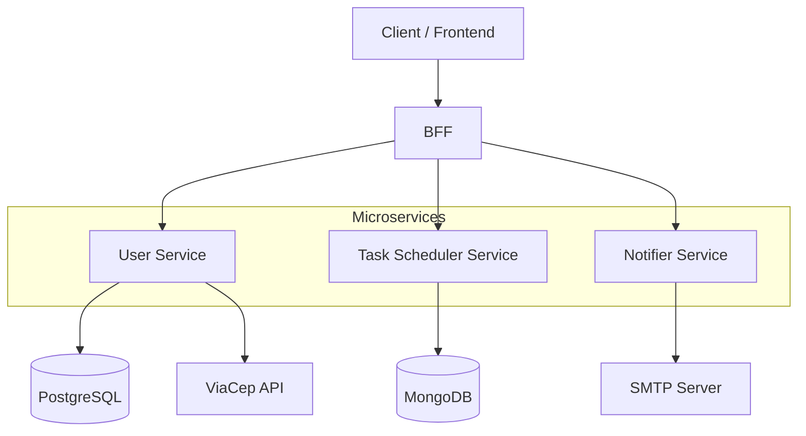

# Task Scheduler — System Repository

System repository responsible for orchestrating the Task Scheduler platform using Docker Compose.

The platform is composed of multiple backend microservices that together implement authentication, task scheduling, notification delivery, and external API integration.

---

# 📌 Project Overview

This repository acts as the orchestration layer for the entire microservices-based backend system.

It provides:

- Container orchestration via Docker Compose
- Centralized environment configuration
- Unified startup process
- Development and production execution functionalities

## 🧠 Design Principles

- Separation of concerns
- Centralized authentication
- Docker-first execution model
- UTC time standardization
- Fail-safe email strategy
- Explicit DTO boundaries
- Centralized error handling

---

# 🏗 Architecture

The Task Scheduler platform consists of four backend services:

| Service                    | Repository                                    |
|----------------------------|-----------------------------------------------|
| BFF (Backend for Frontend) | https://github.com/enzobbom/ts-bff            |
| User Service               | https://github.com/enzobbom/ts-user           |
| Task Scheduler Service     | https://github.com/enzobbom/ts-task-scheduler |
| Notifier Service           | https://github.com/enzobbom/ts-notifier       |

All services are containerized and orchestrated via Docker Compose.



---

## 🔎 Service Responsibilities

### BFF (Backend for Frontend)

- Public API entry point
- Swagger documentation
- Communicates with downstream services using OpenFeign
- Runs scheduled Cron job:
    - Checks tasks scheduled within the next hour
    - Calls Notifier to send reminder emails

### User Service

- Manages:
    - Users
    - Phones
    - Addresses
- JWT authentication (Spring Security)
- Generates token on login
- Validates protected endpoints
- Integrates with ViaCep API for Brazilian CEP lookup

### Task Scheduler Service

- Creates, updates, deletes tasks
- All endpoints require authentication
- Validates JWT via User Service

### Notifier Service

- Single endpoint for sending reminder emails
- Uses SMTP Server (JavaMailSender)
- Falls back to NoOp email service if credentials are not provided

---

## 🔐 Security Model

- JWT-based authentication
- Token issued by User Service
- Token required for protected endpoints

---

## 🔄 Error Handling Strategy

- Global exception handler per service
- Feign Error Decoder at BFF level
- HTTP-based error propagation

---

# ⚙️ Environment Variables

All variables are documented in `.env.example`.

## Security
- TS_JWT_SECRET

## Cron User
- TS_CRON_USER_EMAIL
- TS_CRON_USER_PASSWORD

## Email (Optional)
- TS_SMTP_EMAIL
- TS_SMTP_PASSWORD

## Database
- TS_POSTGRES_USER
- TS_POSTGRES_PASSWORD

If SMTP credentials are not defined, a NoOp email sender is used.

---

# 🚀 Running the Software

The platform can be executed in two ways:

- **Docker mode (recommended)** – run the entire system using only this repository.
- **Local development mode** – run each microservice individually for debugging and development.

The setup steps are identical until Step 3.

---

## 1️⃣ Clone

### HTTPS
```bash
git clone https://github.com/enzobbom/ts-system.git
cd ts-system
```

### SSH
```bash
git clone git@github.com:enzobbom/ts-system.git
cd ts-system
```

For cloning other repositories, visit their pages specified at #architecture.

---

## 2️⃣ Configure Environment

Create your local environment configuration file:

```bash
cp .env.example .env
```

Then open the `.env` file and replace the placeholder values with your own configuration (JWT secret, database credentials, email settings, etc.).

Docker Compose automatically loads variables from the `.env` file.

---

## 3️⃣ Start the System

### 🐳 Option A — Docker Mode (Recommended)

This is the fastest way to run the entire application.  
Only this repository is required.

Start all services:

```bash
docker compose up -d
```

To stop:

```bash
docker compose down
```

---

### 🛠 Option B — Local Development Mode

Intended for developers who want full control and service-level debugging.

Requirements:

- Clone each individual microservice repository
- Configure environment variables (same variables defined in `.env`) either:
    - In your operating system, or
    - In your IDE run configuration
- Ensure PostgreSQL and MongoDB are running
- Start services in the correct dependency order

This mode allows full debugging and independent service execution.

If you still want to use Docker Compose with the development override file:

```bash
docker compose -f docker-compose.yml -f docker-compose.dev.yml up --build
```

For other Docker Compose commands in development mode:

```bash
docker compose -f docker-compose.yml -f docker-compose.dev.yml <command>
```

---

# 🌐 Swagger Documentation

After starting the system:

| Service | Swagger URL |
|----------|-------------|
| BFF | http://localhost:8083/swagger-ui.html |

---

# 🐳 Docker & Ports

| Service | Container Port | Host Port | Description |
|----------|---------------|------------|-------------|
| BFF | 8083 | 8083 | Public API |
| User | 8080 | 8080 | Authentication & user management |
| Task Scheduler | 8081 | 8081 | Task operations |
| Notifier | 8082 | 8082 | Email notification |
| PostgreSQL | 5432 | 5432 | Relational database |
| MongoDB | 27017 | 27017 | Document database |

Database services are not exposed via HTTP.  
They are accessible via their respective ports for development purposes.

---

# 🧪 Testing

The system can be tested using:

- The included Postman collection (recommended)
- Swagger UI
- Direct HTTP calls (curl, HTTPie, etc.)

---

## 📬 Postman Collection – End-to-End Testing

This repository includes a Postman collection demonstrating the backend flow end-to-end.

### Setup

Import:

```
./postman/Task Scheduler - E2E testing.postman_collection.json
```

into Postman.

### Collection Variables

- `baseUrl` → `http://localhost:8083`
- `email` → User email for registration/login
- `password` → User password

### Automatic Variable Handling

**authToken**
- Created automatically after login
- Injected into protected endpoints
- Cleared if login fails

**Address Variables**
- Created after CEP lookup
- Required before user creation

### Suggested Execution Order

1. Get address by CEP
2. Create user
3. Login
4. Execute protected endpoints

---

## 📘 Swagger Authentication

1. Execute **Login**
2. Copy the generated JWT
3. Click **Authorize**
4. Paste the token (without `Bearer `)
5. Authorize

Swagger will attach the token to protected endpoints automatically.

---

# 📦 Version Compatibility

This section documents the runtime and infrastructure versions used across the platform.

---

## ☕ Java

All services use:

- **Java 17**

Docker base images:
- `eclipse-temurin:17-jdk-jammy`
- `maven:3-eclipse-temurin-17`
- `gradle:jdk17`

---

## 🌱 Spring Boot Versions

| Service | Spring Boot Version |
|----------|---------------------|
| BFF | 4.0.1 |
| User Service | 3.5.8 |
| Task Scheduler Service | 4.0.0 |
| Notifier Service | 4.0.1 |

> All services are compatible with Java 17.

---

## 🐳 Docker

| Component | Version |
|------------|----------|
| Docker Engine | 29.1.3 |
| Docker Compose | Uses Docker Compose V2 (CLI plugin) |
| PostgreSQL Image | `postgres:14-alpine` |
| MongoDB Image | `mongo:8` |

---

## 🗄 Databases

| Database | Version |
|-----------|----------|
| PostgreSQL | 14.20 |
| MongoDB | 8.2.2 |

---

## 🔨 Build Tools

| Service | Build Tool |
|----------|------------|
| BFF | Maven |
| User Service | Gradle |
| Task Scheduler Service | Gradle |
| Notifier Service | Gradle |

---

## 🕒 Time Standard

- All timestamps are stored and processed in **UTC**.
- Containers rely on the base image timezone configuration.

