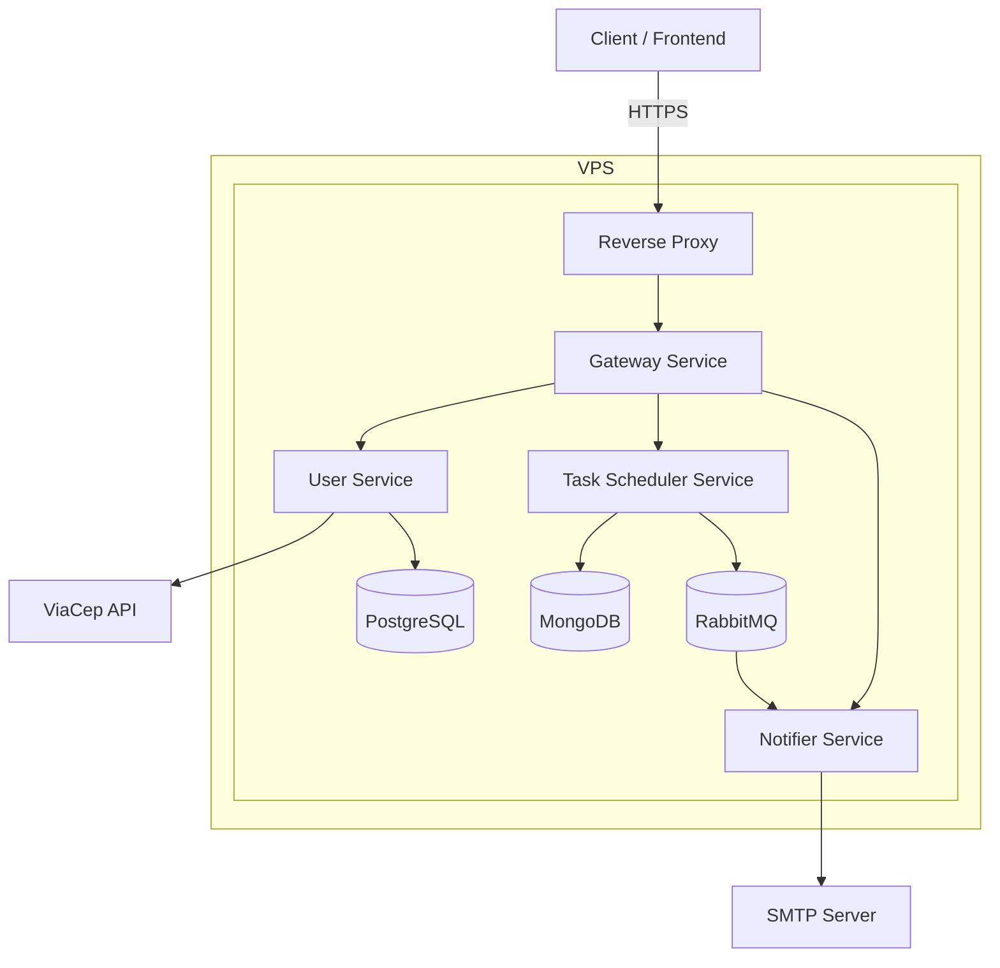
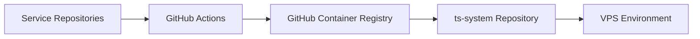

# Task Scheduler Platform — System Repository

System repository responsible for orchestrating the Task Scheduler platform using Docker Compose.

The platform is a microservice-based backend system designed for task scheduling, user management, authentication, and automated notification delivery.

---

# 📌 Project Overview

This repository acts as the infrastructure and orchestration layer of the Task Scheduler platform.

It provides:

* Docker Compose based service orchestration
* Production container configuration
* Centralized runtime environment configuration
* Service networking and dependency management
* Deployment integration with the container registry and VPS environment

The platform follows a Docker-first architecture, where each backend service is independently built, versioned, and deployed as a container image.

---

# 🧠 Design Principles

* Separation of concerns between business domains
* Centralized authentication through an API Gateway
* Independent microservice lifecycle
* Event-driven communication where asynchronous processing is required
* Explicit API contracts between services
* Centralized error handling strategy
* UTC time standardization
* Fail-safe notification delivery strategy

---

# 🏗 Architecture

The Task Scheduler platform consists of four backend services:

| Service          | Repository                              |
| ---------------- | --------------------------------------- |
| Gateway Service  | https://github.com/enzobbom/ts-gateway  |
| User Service     | https://github.com/enzobbom/ts-user     |
| Task Service     | https://github.com/enzobbom/ts-task     |
| Notifier Service | https://github.com/enzobbom/ts-notifier |

All services are containerized and orchestrated through Docker Compose.

Container images are published to GitHub Container Registry (GHCR) and deployed to a VPS environment.

```mermaid
flowchart TB

    Client["Client / Frontend"]

    ViaCep["ViaCep API"]
    SMTP["SMTP Server"]

    subgraph VPS["VPS"]
        subgraph VPS2[" "]
            ReverseProxy["Reverse Proxy"]
        Gateway["Gateway Service"]
        User["User Service"]
        Task["Task Scheduler Service"]
        Notifier["Notifier Service"]
        Postgres[(PostgreSQL)]
        Mongo[(MongoDB)]
        RabbitMQ[(RabbitMQ)]
        end
    end

    ReverseProxy --> Gateway

    User --> ViaCep
    User --> Postgres

    Gateway --> User
    Gateway --> Task
    Gateway --> Notifier

    Task --> Mongo
    Task --> RabbitMQ
    
    RabbitMQ --> Notifier

    Client -->|HTTPS| ReverseProxy
    Notifier --> SMTP
```

---

## 🔎 Service Responsibilities

### Gateway Service

The single entry point of the platform.

Responsibilities:

* Routes incoming requests to internal services
* Validates JWT authentication
* Propagates authenticated user context to downstream services
* Aggregates OpenAPI documentation
* Centralizes API access policies

---

### User Service

Responsible for user management and authentication.

Responsibilities:

* User registration and management (including Address and Phone details)
* JWT generation during authentication
* Spring Security based authentication flow
* Brazilian CEP (Postal Code) lookup integration through ViaCep API

---

### Task Scheduler Service

Responsible for task lifecycle management and scheduling logic.

Responsibilities:

* Creates, updates, retrieves, and deletes tasks
* Stores scheduled tasks
* Identifies tasks ready for notification
* Publishes notification requests through RabbitMQ
* Manages notification delivery state and retry logic

---

### Notifier Service

Responsible for notification delivery.

Responsibilities:

* Consumes notification events from RabbitMQ
* Sends reminder emails through SMTP
* Tracks notification success or failure
* Provides fail-safe behaviour when email configuration is unavailable

---

# 🔐 Security Model

The platform uses a centralized JWT authentication strategy.

Authentication flow:

1. User authenticates through the User Service.
2. User Service generates a JWT token.
3. Client sends authenticated requests through the Gateway.
4. Gateway validates the JWT.
5. Gateway forwards authenticated user information to internal services.

Internal services are not directly exposed as public entry points.

---

# 🔄 Communication Strategy

The platform uses different communication approaches depending on the use case.

## Synchronous Communication

Used for request/response operations:

* Gateway → User Service
* Gateway → Task Service
* Gateway → Notifier Service

Implemented through HTTP APIs.

---

## Asynchronous Communication

Used for notification processing:

* Task Service publishes notification requests.
* Notifier Service consumes notification events.
* Notifier Service publishes processing results.

---

# 📦 Container Deployment

The platform is deployed as a collection of Docker containers.

Container images are built independently for each service and published to:

* GitHub Container Registry (GHCR)

The system repository references the required image versions through Docker Compose configuration.

Deployment flow:

```mermaid
flowchart LR

    Services[Service Repositories]

    Actions[GitHub Actions]

    GHCR[GitHub Container Registry]

    System[ts-system Repository]

    VPS[VPS Environment]

    Services --> Actions
    Actions --> GHCR

    GHCR --> System

    System --> VPS
```

When service images are updated, the system repository updates Docker Compose image references and triggers deployment on the VPS environment.

---

# 🌐 Production Environment

The platform runs on a VPS environment using:

* Docker Engine
* Docker Compose
* Nginx reverse proxy
* HTTPS certificates
* GitHub Container Registry images

External traffic reaches the platform through the reverse proxy, which forwards requests to the Gateway service.

Only the Gateway service is publicly accessible.

Internal services communicate through the Docker network.

---

# ⚙️ Environment Configuration

Runtime configuration is provided through environment variables.

Sensitive values are stored outside the repository and injected into the deployment environment.

Main configuration groups:

## Security

* JWT secret configuration

## Database

* PostgreSQL credentials
* MongoDB credentials

## Messaging

* RabbitMQ credentials

## Notification

* SMTP credentials

---

# 🐳 Docker Services

| Service        | Container Port | Description                        |
| -------------- | -------------- | ---------------------------------- |
| Gateway        | 8083           | Public API entry point             |
| User           | 8080           | Authentication and user management |
| Task Scheduler | 8081           | Task management and scheduling     |
| Notifier       | 8082           | Notification processing            |
| PostgreSQL     | 5432           | User relational database           |
| MongoDB        | 27017          | Task document database             |
| RabbitMQ       | 5672           | Message broker                     |

Database and messaging services are internal infrastructure components and are not exposed externally.

---

# 🌐 API Documentation

The Gateway service provides the unified API documentation entry point.

Swagger documentation is aggregated from backend services and exposed through the Gateway.

---

# 📦 Shared Libraries

The platform uses shared libraries to maintain consistency between microservices.

## ts-api-contract

Provides shared API contracts between services:

* Standard success and error response structures
* API URI versioning structure
* Shared authentication-related HTTP headers

## ts-events

Provides shared messaging contracts between services:

* Notification lifecycle events (request, completion, and failure)
* Shared resource identifiers

# 📘 Technology Stack

## ☕ Backend

* Java 17
* Spring Boot 4 (Spring Framework 7)
* Spring Security
* Spring Data JPA
* Spring Data MongoDB
* Spring Cloud Gateway
* OpenFeign

---

## 🐳 Infrastructure

* Docker
* Docker Compose
* GitHub Actions
* GitHub Container Registry (GHCR)

---

## 🗄 Databases & Messaging

* PostgreSQL
* MongoDB
* RabbitMQ

---

## 🔧 Build Tools

* Gradle

---

## 🌐 External Integrations

* SMTP (email delivery)
* ViaCep API (Brazilian postal code lookup)

---

## 🕒 Time Standard

* All timestamps are stored and processed using UTC.
